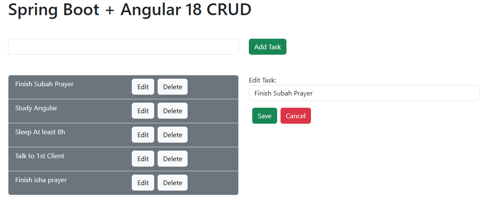

# 📋 ToDoFullStack

ToDoFullStack is a full-stack web application designed to help users manage their daily tasks efficiently. 📝 
The application provides features such as creating, updating, deleting, and organizing tasks.  
It is built using Angular for the front end and Spring Boot for the back end, with MySQL as the database.

---

## ✨ Features
- ➕ **Add, edit, and delete tasks**
- ✅ **Mark tasks as complete or pending**
- 🎨 **Responsive user interface with Bootstrap**
- 💾 **Persistent data storage with MySQL**

---

## 🔧 Tech Stack

### **Frontend:**  
- Angular 18 ⚛️  
- HTML, CSS, Bootstrap 🎨 
- TypeScript 🛠️  

### **Backend:**  
- Spring Boot 🌱  
- MySQL Database 💾  

---

## 🚀 Installation

### Prerequisites  
- Node.js and npm installed 🌐 
- Angular CLI installed globally 🖥️  
- Java Development Kit (JDK) installed ☕  
- MySQL server running 🗄️  

---

### Steps to Run the Project

1. **Clone the Repository**:  
   ```bash  
   git clone https://github.com/aashif-sajah/ToDoFullStack.git  
   cd ToDoFullStack  
   ```

2. **Set Up the Frontend**:  
   ```bash  
   cd FrontEnd  
   npm install  
   ng serve  
   ```  
   The frontend will be available at `http://localhost:4200`.

3. **Set Up the Backend**:  
   - Navigate to the `BackEnd` folder.  
   - Import the project into your preferred IDE (e.g., IntelliJ IDEA, Eclipse).  
   - Configure the database connection in `application.properties`.  
   - Run the Spring Boot application.  
   The backend will be available at `http://localhost:8080`.

4. **Database Setup**:  
   - Create a MySQL database named `todo_db` (or as configured in `application.properties`).  
   - Run the provided SQL scripts to set up the required tables.

---

## 🛠️ Usage

- Open the frontend in your browser.  
- Use the UI to add, edit, and manage your tasks.  
- Tasks are synchronized with the backend and stored in the MySQL database.

---

## 🤝 Contribution Guidelines

We welcome contributions! Here's how you can help:  

1. Fork the repository.  
2. Create a new branch for your feature or bug fix.  
3. Commit your changes with descriptive messages.  
4. Open a pull request, and provide a detailed description of your changes.  

---

## 📜 License

This project is licensed under the **MIT License**. See the `LICENSE` file for details.

---

## 📸 Screenshot  

  


